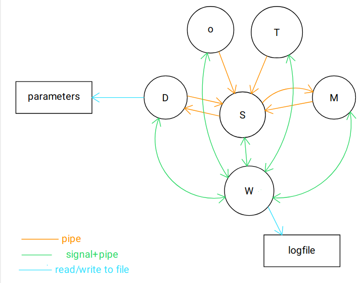

# Basic drone movement simulator, part 2

## Architecture of the software

The software for this simulator is structured as shown in the following picture:

In the above picture D is the process responsible of the drone dynamics, M is the blackboard server and the process responsible of displaying the game map, and W is the watchdog process with the task of monitoring the activity of the other 2 processes.
The changeable parameters of the dynamics are stored in the parameters file (*parmeters.txt* file), the status of the processes is stored in the logfile (*log_results.txt* file).
All 3 processes are started from a master process.

## Processes composing the project

Here is a more detailed description of the 3 processes:

### Drone dynamics process

The process responsible of the drone's dynamics first reads the parameters from the (editable) *parameters.txt* file structured as follow:

1. force increase unit with each key press (in newton) (current value: 1N);
2. mass of the simulated drone (current value: 0.2 kg);
3. friction coefficient (current value: 0.5 N/(m/s)));
4. coefficient modulating the force applied by walls and obstacles to the drone when close enough (current vaue: 20 N/m^3);
5. maximum distance between drone and an obstacle/ a wall to apply a force to the drone (current value : 5 m);

Then the process runs the following tasks with a frequency of 100 Hz:
1. receives from the server (using a shared memory) the key pressed and processes the corresponding action : if the w, e, r, f, v, c, x or s keys are pressed the force applied by the virtual thrusters is increased of one increase unit (input parameter) in the corresponding direction (including diagonal), the d key brings to 0 the force of the thrusters, the z key restarts the game and the q makes the process quit while any other key received is treated as no key pressed; 
2. based on the current position of the drone the force applied by the walls to the drone is computed;
3. from the current and last positions of the drone (stored inside of the process itself) and the sum of the forces the drone is subject to the next drone position is computed starting from the euler approximation of the model of the drone; the current and last drone positions are the updated per the next loop iteration;
4. the next drone position is sent to the blackboard using another shared memory.

### Blackboard

The blackboard server is tasked also with reading the keyboard input for the drone control and displaying the playfield by showing the drone position and the map border. In particular with a frequency of 50 HZ:

1. reads keyboard input and sends it to the dynamics process with a shared memory (and quits if the key pressed is q);
2. receives the drone position from the dynamics process using a shared memory and elaborates the obtained coordinates to match with the values required for the ncurses functions to display;
3. updates the display board (on the map are printed the border of the field in white and the current drone position with a green 'X', while the background is black-coloured; both the placement on the display and the colouring are realized using functions from the ncurses library.

### Watchdog

The task of the watchdog is to periodically monitor the processes' responses in order to try and detect eventuals locks/crashes in the software's processes; in order to achieve this goal every 2 seconds this process:

1. sends a signal to each of the process it is tasked to monitor;
2. waits a bit to ensure that every process has had the chance to answer to the signal by writing to a specific pipe (one per process);
3. checks which processes answered the signal and updates the last response time of each process accordingly, writing on the logfile when a process has not answered one of these calls;
4. compares the current time with the last response time: if more than 4 seconds of non-response have passed the watchdog registers this on the logfile and kills all the children processes, causing the game to end.

## How to run and install it

Once you downloaded the folder, you need to go to the directory and compile the source code by tiping in the command prompt:
`$ make`
This command is to be written also if you decided to change something inside the source code (any of the .c files or the .h file)
Once that is done you can freely modify the values in the parameters.txt file (__keep one value per row!__) and then starting the game at any moment by writing in the command prompt
`$ ./Master`

## Unistall/ file removal

If you want to remove the binnary code type in the prompt the following command: 
`$ make clean`
To remove the logfile, instead, write in the terminal: 
`$ make clean-logs`

## Operational instructions

The game makes use of Konsole to display the map: make sure it is installed before starting the games. 

Once the game is up and running, make sure that the game window is the selected one, otherwise the key presses will not be read. 

